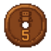
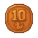
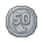
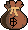

# How To Play

Scroll through this page to see a basic guide on how to play on the server.

## Getting Started

The purpose of the game is to go through the storyline in One Piece, similar to the way the Straw Hats go through their journey! Upon joining the server, you'll wind up at [Spawn Island](/Islands/SpawnIsland). Explore around Spawn and talk to the NPCs there to get a feel for the server and to get some starter items.

After you get used to Spawn Island, you should teleport to [Dawn Island](/Islands/DawnIsland) and start your journey! As soon as you arrive there, talk to Luffy to start the main quest. Each island going forward will have a main questline, so to unlock the next island, complete the main questline of the island you are currently on. The option for the next island will be available in the Teleporter interface once the questline is complete.

## Questing Basics

Every island has the main quest giver. Speak to them to begin the quest. Once you complete the first part of the quest, the next part will appear in your quest log and continue on until you complete the final part. Upon completion, you will unlock the warp for the next island. Simply speak to the final NPC in the questline to warp to the next island. Upon completion, the island will unlock within the Teleporter NPC as well so you can access it at any time.

You will notice that islands also have side quests. The quest giver NPCs are scattered around so you are encouraged to adventure around each island you visit. Most side quests are only specific to their island, however some will require you to travel around the One Piece world.

## Completing Islands

Instead of speed running the main quests to push through the islands, it's highly recommended to take your time to complete side quests, unlock discoveries and gather resources on each island. Side quests will give you more teleporting options, discoveries will give you a lot of valuable items that can seriously help with progression, and mining for resouces can earn you extra cash and rewards. You will not be able to 100% each island as some locations and NPC might require prerequisites from later islands, but do what you can.

## Getting Gear

You automatically spawn with a full set of general armor, and you can speak to an NPC to get a starter weapon based on your class. While you can get more than one weapon, it's highly recommended to only choose one for now and claim another starter weapon when you switch styles later on as inventory space is limited. This gear can also be repaired for consistent use and can be upgraded, but it's recommended to farm for gear as general gear does not have any set bonus.

Armor and weapons drop from NPCs. As you progress through the story, you will be able to unlock the ability to fight a wider variety of characters that drop their own gear. For more information on how the gear system works check out the [Gear Guide](/Gear/Overview). The [Island Guide](/Islands/Overview) also displays the weapon and armor drops that each boss has a chance to drop.

If you're lucky, another player may be selling a weapon or armor piece you are looking for so keep an eye on the [Market](/POI/Market.md) to see if there's anything that you can afford.

## Server Currency

The main currency is Belly. It is used to purchase items or commodities from a variety of shops or other players. Belly can be converted into higher and lower volumes by talking to the Banker at various islands with banks.

|Currency Icon|Currency Denominations|
|:-----------:|----------------------|
|           |1 Belly Coin|
|           |5 Belly Coin|
|         |10 Belly Coin|
|         |50 Belly Coin|
|       |100 Belly Coin|
|       |500 Belly Coin|
|    |1,000 Belly Bill|
|    |5,000 Belly Bill|
|  |10,000 Belly Bill|
| |100,000 Belly Bag|

## How To Get Rich

There are many ways to get belly. Please see the information below for the best and most common ways to get belly:

1. Defeat Bosses: All bosses have a 100% chance to drop belly and the amount gets higher based on difficulty.
2. Complete Quests: Rewards will get better as the game progresses. Questlines can be repeated weekly.
3. Market: Selling items to other players for belly
4. Salvaging: Quick way to get belly for unused gear.
5. Discoveries: Speaking to citizens, unlocking safes, opening chests and other discovery functions.
6. Resources: You can sell gathered resources to the resource merchant for belly.

## Storage

There are a couple options to store your items.

1. Inventory: You have a standard hotbar and 3 rows that is accessible at the beginning, with 3 extra unlockable rows to expand it. Each locked slot costs 1,000 belly to unlock.
2. Bank: The bank has a storage tab to store items. The first page is unlocked right away, and more pages can be unlocked by paying for them over time.
